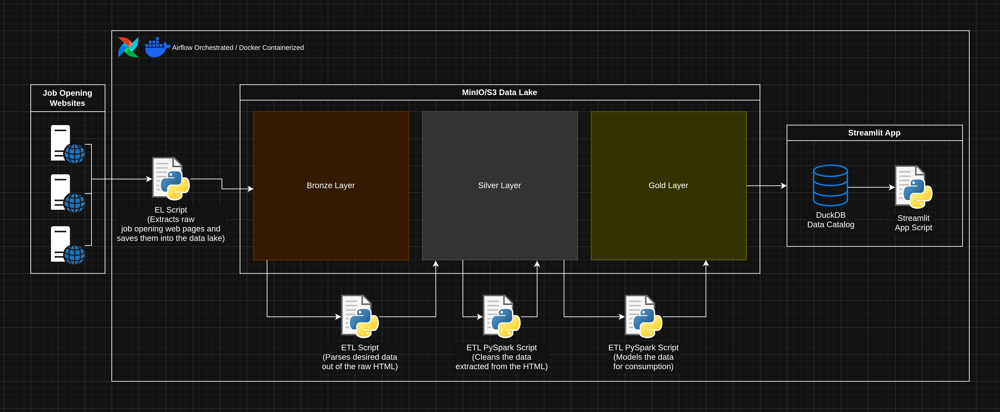
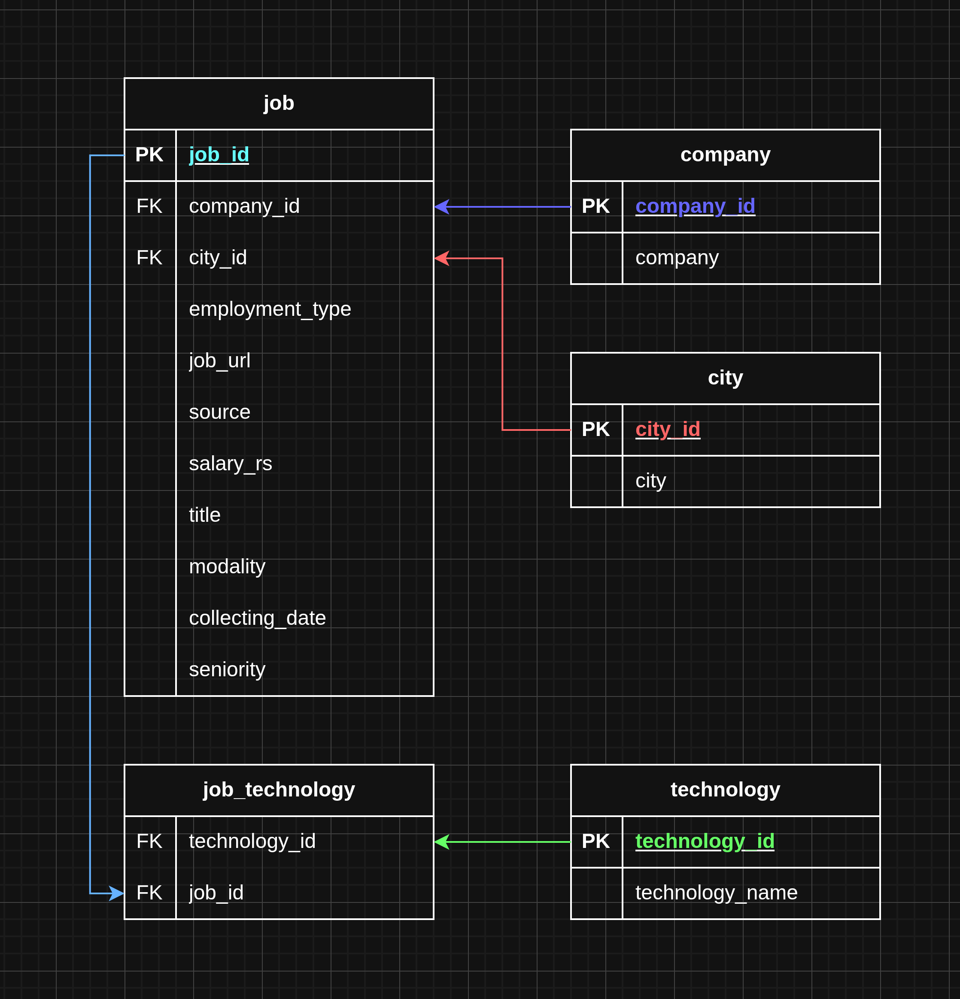

# tech-jobs-data-pipeline

## Sumário

-   [Sobre](#sobre)
-   [Setup](#setup)

## Sobre

Este projeto consiste em uma **pipeline de dados** responsável por
realizar **web scraping** de vagas de emprego na área de tecnologia a
partir de três fontes diferentes: **NerdIn**, **Programathor** e
**Vagas.com**.

Após a etapa de extração, os dados passam por múltiplas fases de
**processamento e transformação** até atingirem o formato ideal para a
finalidade proposta: um **site agregador de vagas de tecnologia**. Em
cada etapa da pipeline, os dados são armazenados em **camadas distintas
de um bucket de armazenamento**, garantindo **histórico**,
**rastreabilidade** e **reprocessamento confiável** das informações.

Toda essa pipeline viabiliza a existência de um **aplicativo em
Streamlit**, que permite a navegação pelas vagas coletadas, oferecendo
recursos como **filtros personalizados**, visualização de informações
detalhadas e **acesso direto ao link original** de cada vaga.

Diagrama explicando visualmente os componentes e funcionamento do projeto:


Na camada Gold são gravados os dados modelados para poderem ser consumidos pelo App, seguindo a seguinte estrutura:


O app está hospedado no link https://tech-jobs-data-pipeline-lt8l7hzcnhwazy5jztldst.streamlit.app/ e possui um conjunto de dados correspondente à **extração de um único
dia**, apenas para **demonstração do app**.

------------------------------------------------------------------------

## Setup

Independente se o projeto será executado **manualmente** ou **pelo
Airflow**, o primeiro passo para a instalação do projeto é baixar o
repositório executando o seguinte comando no diretório onde desejar que
ele fique:

``` bash
git clone https://github.com/VictorClvtt/tech-jobs-data-pipeline.git
```

Com o repositório baixado, basta decidir **como deseja executar o
projeto** e seguir as instruções de uma das opções a seguir.

------------------------------------------------------------------------

### Execução Manual

Antes de se preocupar com as dependências necessárias para a **execução
do código do projeto**, é necessário satisfazer duas **dependências de
ambiente**:

-   **JDK 17** (compatível com Spark), que pode ser instalada com o
    comando:

    ``` bash
    sudo pacman -S jdk17-openjdk
    ```

-   **MinIO** (utilizado como bucket de armazenamento), que pode ser
    executado localmente com Docker por meio do comando:

    ``` bash
    docker run -d \
      --name minio \
      --hostname minio \
      -p 9000:9000 \
      -p 9001:9001 \
      -e MINIO_ROOT_USER=admin \
      -e MINIO_ROOT_PASSWORD=admin123 \
      -v minio-data:/data \
      --restart unless-stopped \
      minio/minio:latest server /data --console-address ":9001"
    ```

*(assumindo que você já tenha o Docker instalado)*

------------------------------------------------------------------------

Para executar o código do projeto manualmente, primeiramente crie um
**virtual environment** do Python no diretório raiz do projeto:

``` bash
python -m venv .venv
```

Em seguida, ative o virtual env:

``` bash
source .venv/bin/activate
```

Depois disso, instale as bibliotecas necessárias listadas em
[`requirements.txt`](./requirements.txt):

``` bash
pip install -r requirements.txt
```

Após a instalação de todas as bibliotecas, o ambiente estará pronto para
a execução manual dos scripts do projeto.

------------------------------------------------------------------------

É importante ressaltar que os scripts foram feitos para serem executados
como **módulos**, a partir do diretório raiz do projeto. Alguns exemplos
de execução:

``` bash
python -m src.bronze.run_bronze
python -m src.silver.run_silver_normalizer
python -m src.gold.run_gold
```

> Apesar de todas as etapas da pipeline terem sido modularizadas, nem
> todas foram programadas para serem executadas de forma simples via
> linha de comando como mostrado acima. Ainda assim, é perfeitamente
> possível executar manualmente as principais etapas da pipeline:
> **bronze**, **silver** e **gold**.

------------------------------------------------------------------------

Para executar o **app Streamlit**
[`streamlit_app.py`](./src/app/streamlit_app.py), utilize o mesmo
virtual env e execute:

``` bash
streamlit run src/app/streamlit_app.py
```

------------------------------------------------------------------------

Também é importante **renomear manualmente** o arquivo
[`.env.example`](./.env.example) para `.env`, para que os scripts
consigam ler as variáveis de ambiente. Caso necessário, os valores das
variáveis podem ser alterados sem problemas.

------------------------------------------------------------------------

**OBS**:\
O app Streamlit possui um parâmetro **hard coded** em uma constante na
**linha 29** do arquivo
[`streamlit_app.py`](./src/app/streamlit_app.py). Esse parâmetro define
a fonte de dados utilizada pelo app.

Valor atual:

``` python
DATA_SOURCE = "local"
```

Esse valor faz com que o app leia os dados de um **catálogo DuckDB**
previamente criado para demonstração, independente dos dados presentes
no bucket.

Para que o app leia **diretamente os dados do MinIO**, altere para:

``` python
DATA_SOURCE = "minio"
```

------------------------------------------------------------------------

### Execução via Airflow/Docker

Para a execução da pipeline utilizando **Airflow via Docker**, é
necessário ter os seguintes pré-requisitos instalados na máquina:

-   **Astro CLI**
-   **Docker**
-   **Docker Compose**

Com todos os requisitos instalados, execute o **script de setup** do
ambiente Docker Compose para o Airflow.

Antes disso, certifique-se de atribuir permissão de execução ao script:

``` bash
chmod +x airflow_setup.sh
```

Em seguida, execute o script:

``` bash
./airflow_setup.sh <nome-do-data-lake>
```

O parâmetro entre `<>` corresponde ao **nome do data lake**, que será
utilizado durante a execução do script e propagado para o arquivo `.env`
do Airflow, sendo consumido pelas tasks.

Após a conclusão do script, o ambiente estará pronto para executar a
pipeline conforme o agendamento definido na DAG:

👉 [`tech_jobs_dag.py`](./airflow/dags/tech_jobs_dag.py)

------------------------------------------------------------------------

Caso haja interesse, é possível alterar os valores das variáveis
presentes no arquivo [`.env.example`](./airflow/.env.example) **antes**
da execução do setup, sem problemas.

------------------------------------------------------------------------

**OBS**:\
O app Streamlit presente no ambiente do Airflow
([`streamlit_app.py`](./airflow/include/src/app/streamlit_app.py))
também possui o mesmo parâmetro **hard coded** na linha 29.

Valor atual:

``` python
DATA_SOURCE = "local"
```

Para alterar a leitura para os dados do bucket MinIO:

``` python
DATA_SOURCE = "minio"
```
